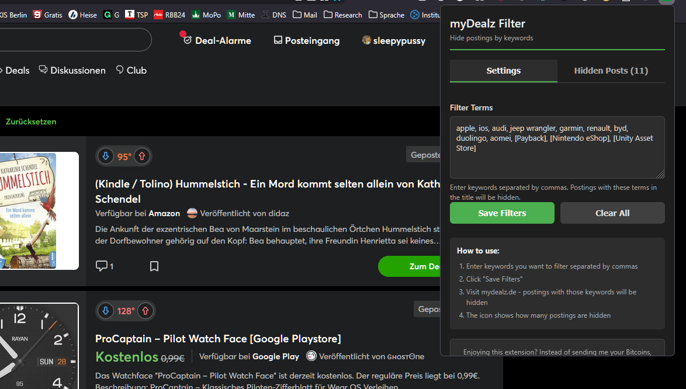

# myDealz Filter Extension

## Deutsche Anleitung

Na, keine Lust ständig Apple Deals in deinem Feed zu haben? Oder Auto-Deals? Keine Sorge! Jetzt kein Problem mehr. Einfach diese Extension installieren, bestimmte Suchbegriffe eingeben und die Extension blendet jeden Deal einfach aus, der einen der Suchbegriffe im Titel hat. Its so easy! Warum mydealz das wohl noch nicht geschafft hat ..

Eine Firefox-Erweiterung, die es Benutzern ermöglicht, Einträge auf mydealz.de nach Schlüsselwörtern im Titel zu filtern. Einträge mit bestimmten Schlüsselwörtern werden ausgeblendet und eine grüne Kennzeichlung zeigt an, wie viele Einträge gefiltert wurden.

### Funktionen

- Filtern von Deal-Einträgen nach Schlüsselwörtern im Titel
- Mit Tabs versehenes Popup-Fenster mit Registerkarten für Einstellungen und ausgeblendete Beiträge
- Grüne Zähler-Anzeige mit der Anzahl der ausgeblendeten Einträge
- Echtzeit-Filterung während neuer Inhalte geladen werden
- Anzeige der ausgeblendeten Angebote mit anklickbaren Links im Tab "Ausgeblendete Beiträge"
- Anzeige, welcher Filterbegriff dazu führte, dass ein Angebot ausgeblendet wurde
- Berücksichtigung der dunklen/hellen Modus-Einstellung des Benutzers
- Zurücksetzen des Zählers beim Neuladen der Seite
- Kompatibel mit Firefox (Manifest V3)
- Enthält Spenden-Buttons für Buy Me a Coffee und PayPal

### Installation

#### Für Entwicklung

1. Klonen oder Herunterladen dieses Repositories
2. Firefox öffnen und zu `about:debugging`
3. Auf "Dieser Firefox" klicken
4. Auf "Temporäres Add-on laden" klicken
5. Die Datei `manifest.json` aus diesem Verzeichnis auswählen

**Zukünftige Verfügbarkeit:** Ich plane, diese Erweiterung so bald wie möglich von Mozilla verifizieren zu lassen, damit sie auch im Online-Verzeichnis für Add-ons verfügbar ist.

### Verwendung

1. Das Popup-Fenster der Erweiterung durch Klicken auf das Symbol in der Symbolleiste aufrufen
2. Schlüsselwörter eingeben, die gefiltert werden sollen, durch Kommas getrennt (z.B. "iPhone, Apple, Samsung")
3. Auf "Filter speichern" klicken
4. Zu mydealz.de navigieren - Einträge mit diesen Schlüsselwörtern im Titel werden ausgeblendet
5. Die grüne Kennzeichnung am Erweiterungssymbol zeigt an, wie viele Einträge ausgeblendet wurden
6. Erneut auf das Erweiterungssymbol klicken, um eine Liste der ausgeblendeten Angebote mit anklickbaren Links und dem Filterbegriff anzuzeigen, der zum Ausblenden führte

---

## English Instructions

Tired of constantly seeing Apple deals in your feed? Or car deals? No worries! Now it's no longer a problem. Simply install this extension, enter specific search terms, and the extension will hide any deal that has one of the search terms in the title. It's so easy! Wonder why mydealz haven't figured this out yet ..

A Firefox extension that allows users to filter postings on mydealz.de by keywords in the title. Postings containing specified keywords are hidden from view, and a green badge shows how many postings have been filtered out.

### Features

- Filter deal postings by keywords in the title
- Tabbed popup interface with Settings and Hidden Posts tabs
- Green badge counter showing number of hidden postings
- Real-time filtering as new content loads
- Shows hidden deals with clickable links in the Hidden Posts tab
- Displays which filter term caused each deal to be hidden
- Respects user's dark/light mode preference
- Reset counter on page reload
- Compatible with Firefox (Manifest V3)
- Includes donate buttons for Buy Me a Coffee and PayPal

### Installation

#### For Development

1. Clone or download this repository
2. Open Firefox and navigate to `about:debugging`
3. Click "This Firefox"
4. Click "Load Temporary Add-on"
5. Select the `manifest.json` file from this directory

**Future Availability:** I plan to get this extension verified by Mozilla as soon as possible, and then it also should be in the addons directory online.

### Usage

1. Visit the extension's popup by clicking its icon in the toolbar
2. Enter keywords you want to filter, separated by commas (e.g., "iPhone, Apple, Samsung")
3. Click "Save Filters"
4. Navigate to mydealz.de - postings with those keywords in the title will be hidden
5. The green badge on the extension icon shows how many postings have been hidden
6. Click the extension icon again to see a list of hidden deals with clickable links and the filter term that caused each to be hidden

## Technical Details

### Files Structure

- `manifest.json` - Extension metadata and permissions
- `src/content-script.js` - Main filtering logic that runs on mydealz.de pages
- `src/popup.html` - Tabbed interface for entering filter terms and viewing hidden deals
- `src/popup.css` - Styling for the popup interface with dark/light mode support
- `src/popup.js` - Logic for the tabbed popup interface
- `src/background.js` - Handles badge updates and message routing
- `icons/` - Extension icon files
- `README.md` - General information about the extension
- `LICENSE` - MIT License
- `test-page.html` - Test page to validate functionality
- `DEVELOPMENT.md` - Development guidelines
- `CHANGELOG.md` - Change history
- `SETUP.md` - Setup instructions
- `PROJECT_SUMMARY.md` - Project overview

### How Filtering Works

1. The content script runs when visiting mydealz.de
2. It identifies deal postings using various selectors optimized for mydealz.de structure
3. It extracts titles from the postings
4. It compares titles against the filter terms (case-insensitive)
5. Matching postings are hidden by setting `display: none`
6. A mutation observer detects new content and reapplies filters
7. The background script updates the green badge counter
8. The popup provides a tabbed interface: Settings tab for filter configuration and Hidden Posts tab for viewing hidden deals with links and filter terms

## Privacy and Data Handling

This extension:
- Does NOT collect or transmit any personal data
- Does NOT send any information to external servers
- Stores filter terms locally in the browser's storage
- Only operates on the mydealz.de domain as specified in permissions
- Does NOT inject ads or modify web content beyond hiding filtered postings
- Only accesses hidden deals information when the popup is opened

## Compatibility

This extension is designed to work with:
- Firefox (with Manifest V3 support)
- May work with Chrome/Chromium browsers with minor adjustments

## Contributing

To contribute to this extension:

1. Fork the repository
2. Create a feature branch (`git checkout -b feature/amazing-feature`)
3. Make your changes
4. Commit your changes (`git commit -m 'Add some amazing feature'`)
5. Push to the branch (`git push origin feature/amazing-feature`)
6. Open a Pull Request

## Support the Project

If you find this extension useful, consider supporting the development:

- [Buy me a coffee](https://buymeacoffee.com/codingiymynewgaming)
- [Donate via PayPal](https://www.paypal.com/donate/?hosted_button_id=ZXHJFTUW9NQK8)

## Contact / Feedback / Issues / Feature Requests

For questions, feedback, bug reports, or feature requests:
- GitHub: [https://github.com/codingismynewgaming](https://github.com/codingismynewgaming)

## Release Information

Version: 1.0.0
Release Date: Wednesday, 11 February 2026

## License

MIT License - See LICENSE file for details.